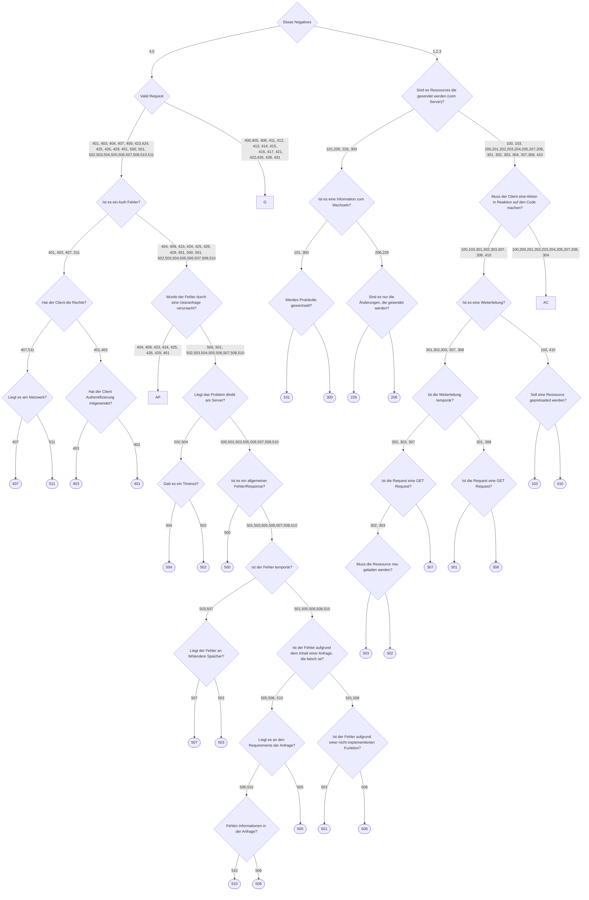

# Questions (current status)

```mermaid
flowchart TD
      A{Etwas Negatives} -->|4,5| B{Valid Request}
      A -->|1,2,3| D{"Sind es Ressources die gesendet werden (vom Server)?"}
      B -->|401, 403, 404, 407, 409, 423,424, 425, 426, 429, 451, 500, 501, 502,503,504,505,506,507,508,510,511| E{Ist es ein Auth Fehler?}
      B -->|400,405, 406, 411, 412, 413, 414, 415,
            416, 417, 421, 422,426, 428, 431| G
      D -->|101,206, 226, 300| N{Ist es eine Information zum Wechseln?}
      D -->|100, 103, 200,201,202,203,204,205,207,208, 301, 302, 303, 304, 307,308, 410| L{Muss der Client eine Aktion in Reaktion auf den Code machen?}
      E -->|401, 403, 407, 511| M{Hat der Client die Rechte?}
      E -->|404, 409, 423, 424, 425, 426, 429, 451, 500, 501, 502,503,504,505,506,507,508,510| O{Wurde der Fehler durch eine Useranfrage verursacht?}
      N -->|101, 300| P{Werden Protokolle gewechselt?}
      N -->|206,226| Q{Sind es nur die Änderungen, die gesendet werden?}
      Q --> R([226])
      Q --> S([206])
      P --> T([101])
      P --> U([300])
      M -->|407,511| W{Liegt es am Netzwerk?}
      M -->|401,403| V{Hat der Client Authentifizierung mitgesendet?}
      W -->|407| X([407])
      W -->|511| Y([511])
      V -->|403| Z([403])
      V -->|401| AA([401])
      L -->|100,103,301,302,303,307, 308, 410| AB{Ist es eine Weiterleitung?}
      L -->|100,200,201,202,203,204,205,207,208, 304| AC
      AB -->|301,302,303, 307, 308| AD{Ist die Weiterleitung temporär?}
      AB -->|103, 410| AR{Soll eine Ressource gepreloaded werden?}
      AD -->|302, 303, 307| AE{Ist die Request eine GET Request?}
      AD -->|301, 308| AF{Ist die Request eine GET Request?}
      AF -->AG([301])
      AF --> AH([308])
      AR --> AI([103])
      AR --> AJ([410])
      AE -->|302, 303| AK{Muss die Ressource neu geladen werden?}
      AE -->AL([307])
      AK --> AM([303])
      AK --> AN([302])
      O -->|404, 409, 423, 424, 425, 426, 429, 451| AP
      O -->|500, 501, 502,503,504,505,506,507,508,510| AQ{Liegt das Problem direkt am Server?}
      AQ -->|502,504| AS{Gab es ein Timeout?}
      AQ -->|500,501,503,505,506,507,508,510| AV{Ist es ein allgemeiner Fehler/Response?}
      AS -->|504| AT([504])
      AS -->|502| AU([502])
      AV -->|500| AW([500])
      AV -->|501,503,505,506,507,508,510| AX{Ist der Fehler temporär?}
      AX -->|503,507| AY{Liegt der Fehler an fehlendem Speicher?}
      AX -->|501,505,506,508,510| AZ{Ist der Fehler aufgrund dem Inhalt einer Anfrage, die falsch ist?}
      AZ -->|505,506, 510| BA{Liegt es an den Requirements der Anfrage?}
      AZ -->|501,508| BB{Ist der Fehler aufgrund einer nicht implementierten Funktion?}
      AY -->|507| BC([507])
      AY -->|503| BD([503])
      BB -->|501| BE([501])
      BB -->|508| BF([508])
      BA -->|506,510| BG{Fehlen Informationen in der Anfrage?}
      BA -->|505| BH([505])
      BG -->|510| BI([510])
      BG -->|506| BJ([506])

```