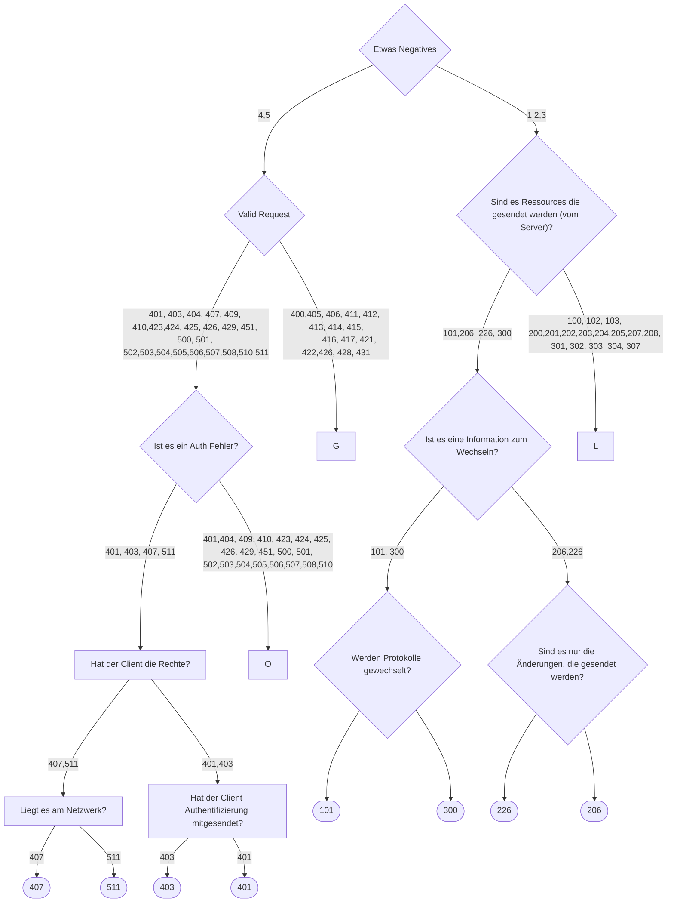

# Questions (current status)

```mermaid
flowchart TD
      A{Etwas Negatives} -->|4,5| B{Valid Request}
      A -->|1,2,3| D{"Sind es Ressources die gesendet werden (vom Server)?"}
      B -->|401, 403, 404, 407, 409, 410,423,424, 425, 426, 429, 451, 500, 501, 502,503,504,505,506,507,508,510,511| E{Ist es ein Auth Fehler?}
      B -->|400,405, 406, 411, 412, 413, 414, 415,
            416, 417, 421, 422,426, 428, 431| G
      D -->|101,206, 226, 300| N{Ist es eine Information zum Wechseln?}
      D -->|100, 102, 103, 200,201,202,203,204,205,207,208, 301, 302, 303, 304, 307| L
      E -->|401, 403, 407, 511| M[Hat der Client die Rechte?]
      E -->|401,404, 409, 410, 423, 424, 425, 426, 429, 451, 500, 501, 502,503,504,505,506,507,508,510| O
      N -->|101, 300| P{Werden Protokolle gewechselt?}
      N -->|206,226| Q{Sind es nur die Änderungen, die gesendet werden?}
      Q --> R([226])
      Q --> S([206])
      P --> T([101])
      P --> U([300])
      M -->|407,511| W[Liegt es am Netzwerk?]
      M -->|401,403| V[Hat der Client Authentifizierung mitgesendet?]
      W -->|407| X([407])
      W -->|511| Y([511])
      V -->|403| Z([403])
      V -->|401| AA([401])

```