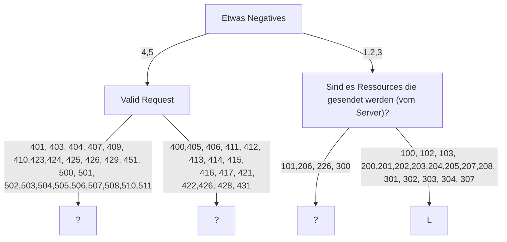

# Questions (current status)

```mermaid
flowchart TD
    A[Etwas Negatives] -->|4,5| B[Valid Request]
    A -->|1,2,3| D["Sind es Ressources die gesendet werden (vom Server)?"]
    B -->|401, 403, 404, 407, 409, 410,423,424, 425, 426, 429, 451, 500, 501, 502,503,504,505,506,507,508,510,511| E[?]
    B -->|400,405, 406, 411, 412, 413, 414, 415,
          416, 417, 421, 422,426, 428, 431| G[?]
   
    D -->|101,206, 226, 300| N[?]
    D -->|100, 102, 103, 200,201,202,203,204,205,207,208, 301, 302, 303, 304, 307| L
```