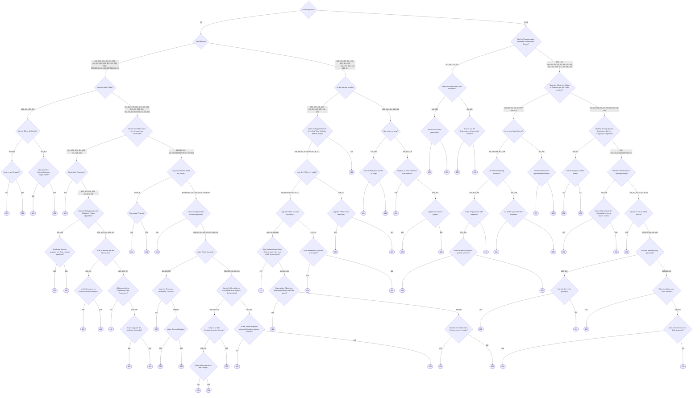

# Questions (current status)

```mermaid
flowchart TD
      A{Etwas Negatives} -->|4,5| B{Valid Request}
      A -->|1,2,3| D{"Sind es Ressources die gesendet werden (vom Server)?"}
      B -->|401, 403, 404, 407,408, 409, 423,424, 425, 426, 429, 451, 500, 501, 502,503,504,505,506,507,508,510,511| E{Ist es ein Auth Fehler?}
      B -->|400,405, 406, 411, 412, 413, 414, 415,
            416, 417, 421, 422, 428, 431| G{Ist die Anfrage korrekt?}
      D -->|101,206, 226, 300| N{Ist es eine Information zum Wechseln?}
      D -->|100, 103, 200,201,202,203,204,205,207,208, 301, 302, 303, 304, 307,308, 410| L{Muss der Client eine Aktion in Reaktion auf den Code machen?}
      E -->|401, 403, 407, 511| M{Hat der Client die Rechte?}
      E -->|404,408, 409, 423, 424, 425, 426, 429, 451, 500, 501, 502,503,504,505,506,507,508,510| O{Wurde der Fehler durch eine Useranfrage verursacht?}
      N -->|101, 300| P{Werden Protokolle gewechselt?}
      N -->|206,226| Q{Sind es nur die Änderungen, die gesendet werden?}
      Q --> R([226])
      Q --> S([206])
      P --> T([101])
      P --> U([300])
      M -->|407,511| W{Liegt es am Netzwerk?}
      M -->|401,403| V{Hat der Client Authentifizierung mitgesendet?}
      W -->|407| X([407])
      W -->|511| Y([511])
      V -->|403| Z([403])
      V -->|401| AA([401])
      L -->|100,103,301,302,303,307, 308, 410| AB{Ist es eine Weiterleitung?}
      L -->|100,200,201,202,203,204,205,207,208, 304| AC{Wird die Anfrage gerade bearbeitet, aber ihr ausgang ist ungewiss?}
      AB -->|301,302,303, 307, 308| AD{Ist die Weiterleitung temporär?}
      AB -->|103, 410| AR{Soll eine Ressource gepreloaded werden?}
      AD -->|302, 303, 307| AE{Ist die Request eine GET Request?}
      AD -->|301, 308| AF{Ist die Request eine GET Request?}
      AF -->AG([301])
      AF --> AH([308])
      AR --> AI([103])
      AR --> AJ([410])
      AE -->|302, 303| AK{Muss die Ressource neu geladen werden?}
      AE -->AL([307])
      AK --> AM([303])
      AK --> AN([302])
      O -->|404, 409, 423, 424, 425, 426, 429, 451| AP{Existiert die Ressource?}
      O -->|408,500, 501, 502,503,504,505,506,507,508,510| AQ{Liegt das Problem direkt am Server?}
      AQ -->|502,504| AS{Gab es ein Timeout?}
      AQ -->|408,500,501,503,505,506,507,508,510| AV{Ist es ein allgemeiner Fehler/Response?}
      AS -->|504| AT([504])
      AS -->|502| AU([502])
      AV -->|500| AW([500])
      AV -->|408,501,503,505,506,507,508,510| AX{Ist der Fehler temporär?}
      AX -->|408,503,507| AY{Liegt der Fehler an fehlendem Speicher?}
      AX -->|501,505,506,508,510| AZ{Ist der Fehler aufgrund dem Inhalt einer Anfrage, die falsch ist?}
      AZ -->|505,506, 510| BA{Liegt es an den Requirements der Anfrage?}
      AZ -->|501,508| BB{Ist der Fehler aufgrund einer nicht implementierten Funktion?}
      AY -->|507| BC([507])
      AY -->|408,503| BD{Ist der Server überlastet?}
      BD -->|503| DX([503])
      BD -->|408| DY([408])
      BB -->|501| BE([501])
      BB -->|508| BF([508])
      BA -->|506,510| BG{Fehlen Informationen in der Anfrage?}
      BA -->|505| BH([505])
      BG -->|510| BI([510])
      BG -->|506| BJ([506])
      AP -->|404| BK([404])
      AP -->|409, 423, 424, 425, 426,429, 451| BP{Wird die Anfrage aufgrund Zeitlichem Timing abgelehnt?}
      BP -->|425, 429| BQ{Wurde die Anfrage aufgrund von Rate Limiting abgelehnt?}
      BP -->|409, 423, 424, 426, 451| BR{Gibt es Konflikt mit der Ressource?}
      BQ -->|429| BS([429])
      BQ -->|425| BT([425])
      BR -->|409,423| BU{Ist die Ressource im Konflikt mit einer anderen?}
      BR -->|424, 426, 451| BV{Gibt es rechtliche Probleme mit der Ressource?}
      BV -->|451| BW([451])
      BV -->|424, 426| BX{Ist ein Upgrade der Methode notwendig?}
      BU -->|409| BY([409])
      BU -->|423| BZ([423])
      BX -->|426| CA([426])
      BX -->|424| CB([424])
      G -->|405, 406, 411, 412, 413,415, 416, 417, 421, 428| CC{Ist die ANfrage technisch fehlerhaft? Also Methode, Header, Body?}
      G -->|400, 414, 422, 428 431| CD{War etwas zu lang?}
      CD -->|414, 431| CE{War ein Resquest Header zu lang?}
      CD -->|400,422, 428| CF{Liegt es an einer fehlenden Precondition?}
      CF -->|428| CK([428])
      CF -->|400, 422| CL{Liegt es an falscher Syntax?}
      CE --> CG([431])
      CE --> CH([414])
      CC -->|405,406,411,412,413,415,416,417| CI{Liegt der Fehler im Header?}
      CC -->|421| CJ([421])
      CL -->|422| CM([422])
      CL -->|400| CN([400])
      CI -->|406,411,412,415,416,417| CO{Liegt der Fehler bei einer Erwartung?}
      CI -->|405,413| CP{Liegt der Fehler in der Methode?}
      CP -->|405| CQ([405])
      CP -->|413| CR([413])
      CO -->|406,411,416,417| CS{Wird ein bestimmer Status Code erwartet, der nicht erfüllt werden kann?}
      CO -->|412,415| CT{Wird der Medien Typ nicht unterstützt?}
      CS -->|417| CU([417])
      CS -->|406,411,416| CV{Erwartet der Client eine bestimmte Ressource/Teile davon?}
      CV -->|416| CW([416])
      CV -->|406,411| CX{Erwartet der Client einen Content-Length-Header?}
      CX -->|411| CY([411])
      CX -->|406| CZ([406])
      CT -->|415| DA([415])
      CT -->|412| DB([412])
      AC -->|100,202| DC{Hat die Response einen Body?}
      AC -->|200, 201,203,204,205,207,208,304| DF{Werden mehrere Status Codes gesendet?}
      DC -->|202| DD([202])
      DC -->|100| DE([100])
      DF -->|207,208| DG{Ist der Status Code der Hinweis auf mehrere Status Codes?}
      DF -->|200,201,203,204,205,304| DJ{Wurde ein neuer Inhalt erstellt?}
      DG -->|207| DH([207])
      DG -->|208| DI([208])
      DJ -->|201| DK([201])
      DJ -->|200,203,204,205,304| DN{Wird ein Inhalt im Body gesendet?}
      DN -->|200, 304| DM{Hat sich der Inhalt geändert?}
      DN -->|203,204,205| DO{Wird eine Aktion vom Client erwartet?}
      DO -->|205| DP([205])
      DO -->|203,204| DQ{Wird ein Information im Body gesendet?}
      DQ -->|204| DR([204])
      DQ -->|203| DS([203])
      DM -->|200| DL([200])
      DM -->|304| DT([304])
```
